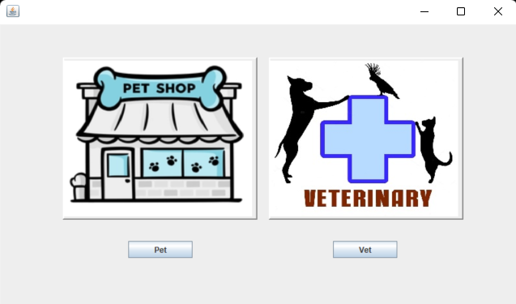

<h1 align="center">Pet & Veterinary</h1>  

    

 

## Table of Contents

- [Demo](#demo)
- [Introduction](#introduction)
- [Technologies](#technologies)
- [Features](#features)
- [Contributors](#contributors)

 

## Demo

 

    

 

## Introduction
This project which is our OOP course project is developed by java. Aim is to make simple operations with java gui with using OOP concepts and terms.
 

## Technologies

* Java

 

## Features

* Animal informations can be added, displayed to the system.
* Appointment can be done through system.
* Pet items and tools can be bought from pet shop section.

 

## Contributors

